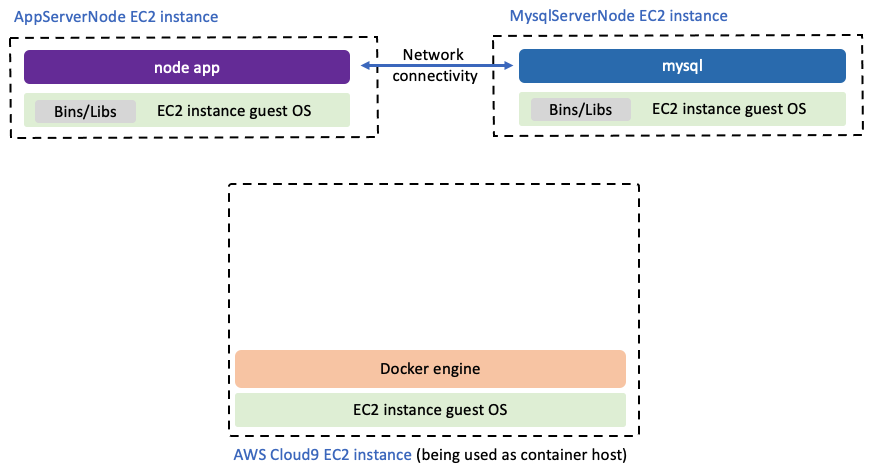

# Migrating-a-Web-Application-to-Docker-Containers
In this lab, you will learn how to migrate a web application to run on Docker containers.

## Architecture Before Migration

Before migrating the application to Docker containers, the architecture of the application hosted on AWS looks like this:

- **Frontend**: Simple HTML.
- **Backend**: Node.js with Express and MySQL database.
- **IDE**: AWS Cloud9

## Steps to Migrate to Docker Containers

